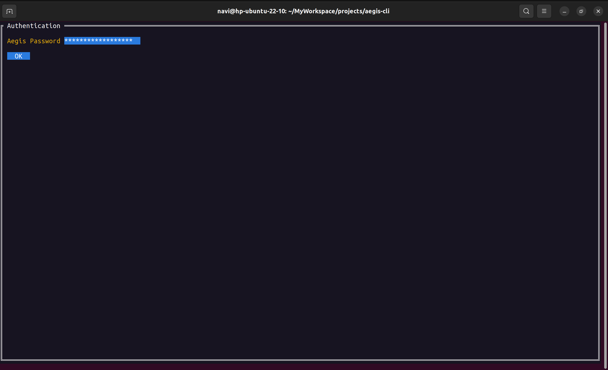
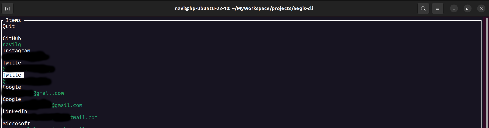
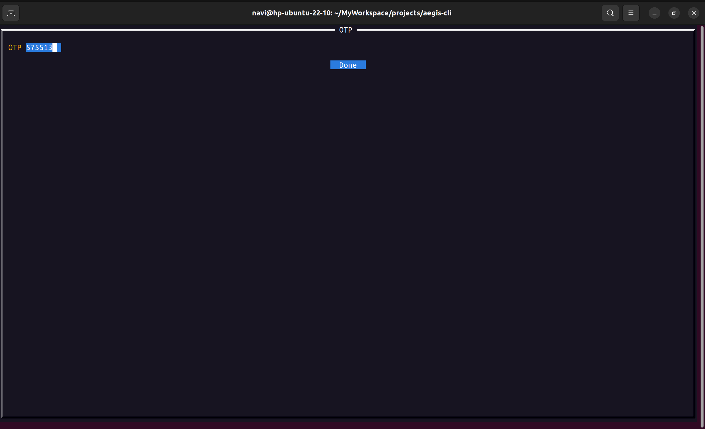

# aegis-cli
Command-line interface to generate 2FA from Aegis' json file

# How to use

1. Install the binary on your system

```
VERSION=latest # For specific version, VERSION=0.2.0
curl -LO https://github.com/navilg/aegis-cli/raw/main/assets/bin/aegis-cli-linux-${VERSION}
chmod +x aegis-cli-linux-${VERSION}
sudo mv aegis-cli-linux-${VERSION} /usr/bin/aegis-cli
```

2. Export vault (encryoted) from your mobile app and put the vault file on your system under `$HOME/.config/aegis-cli` with filename `aegis.json`


3. Execute aegis cli

```
aegis-cli
```

# Screeshots







# Aegis design and architecture

AES 256 in GCM mode is used as AEAD cipher.

Scrypt is used as the KDF with N=2^15, r=8 and p=1

Vault is encrypted using 256-bit master key. This master key is encrypted with credential in stored in slot. This process is called key wrapping.


Vault format:

```
{
    "version": 1,
    "header": {},
    "db": {}
}
```

db contains vault content. If its encrypted, Its value is base64 encoded (with padding) ciphertext of vault content. If its not encrypted, Its in json format.

Header contains `slots` and `params`. 

```
{
    "slots": [],
    "params": {
        "nonce": "0123456789abcdef01234567",
        "tag": "0123456789abcdef0123456789abcdef"
    }
}
```

params contains `nonce` and `tag` that was produced during encryption encoded as hexadecimal string.

Slot is of three type. Type 1 is raw, Type 2 is password and Type 3 is biometric.